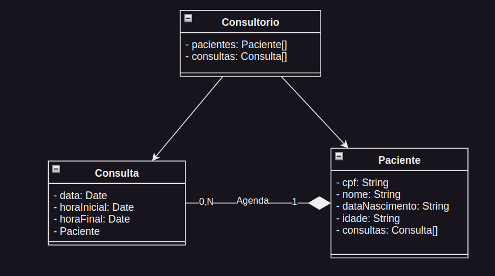
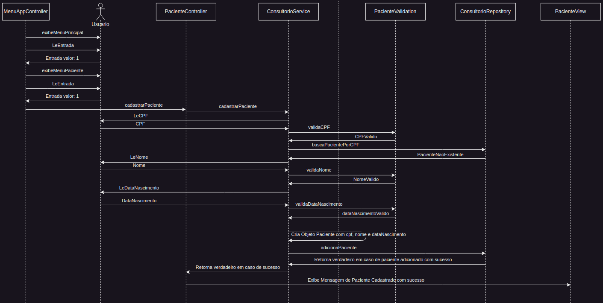

# IUUL_Desafio_3.1

# Documentação - Sistema de Agenda para Consultório Odontológico

## Minimundo
O sistema será uma aplicação console desenvolvida em JavaScript para gerenciar a agenda de um consultório odontológico. A aplicação permitirá o cadastro de pacientes, o agendamento e cancelamento de consultas, e a listagem de pacientes e da agenda. As funcionalidades e regras de negócio estão detalhadas abaixo, junto com os layouts de interface definidos para exibição dos dados.

## Desafio 3.1:
Implementar a persistência dos dados na aplicação desenvolvida no Desafio #1.2. A persistência
deverá ser implementada, obrigatoriamente, usando o Sequelize. O projeto do Desafio #1.2 pode
ser refatorado se você entender que é necessário ou importante aprimorar a estrutura da solução
adotada naquele projeto.


**Modelo de Domínio da Aplicação:**


---

## Funcionalidades

### 1. Inclusão de Pacientes no Cadastro
- **Descrição:** Permite o cadastro de novos pacientes na base de dados do consultório.
- **Requisitos:**
  - CPF, nome e data de nascimento do paciente são obrigatórios.
  - **Regras:**
    - CPF deve ser válido (RN0).
    - O nome do paciente deve ter no mínimo 5 caracteres.
    - A data de nascimento deve estar no formato `DD/MM/AAAA`.
    - Dados inválidos exibem uma mensagem de erro, e a aplicação solicita o dado novamente.
    - Não é permitido o cadastro de dois pacientes com o mesmo CPF.
    - O paciente deve ter 13 anos ou mais no momento do cadastro (data atual).

**Solução esboçada:**



### 2. Exclusão de Pacientes do Cadastro
- **Descrição:** Remove um paciente do cadastro.
- **Requisitos:**
  - CPF do paciente é necessário.
  - **Regras:**
    - Pacientes com consultas futuras não podem ser excluídos.
    - Pacientes com consultas passadas podem ser excluídos, e os respectivos agendamentos são também excluídos.

### 3. Agendamento de Consulta
- **Descrição:** Agenda uma consulta para um paciente cadastrado.
- **Requisitos:**
  - CPF do paciente, data da consulta, hora inicial e hora final.
  - **Regras:**
    - CPF deve existir no cadastro.
    - Data deve estar no formato `DD/MM/AAAA`.
    - Horas inicial e final devem estar no formato `HHMM` (padrão brasileiro).
    - A consulta deve ser agendada para uma data futura: `data da consulta > data atual` ou `data da consulta = data atual` e `hora inicial > hora atual`.
    - Hora final deve ser maior que a hora inicial.
    - Apenas um agendamento futuro por paciente.
    - Não são permitidos agendamentos sobrepostos.
    - As horas devem ser múltiplas de 15 minutos (e.g., 1400, 1730).
    - As consultas devem ocorrer entre 8:00h e 19:00h.

### 4. Cancelamento de um Agendamento
- **Descrição:** Cancela uma consulta previamente agendada.
- **Requisitos:**
  - CPF do paciente, data da consulta, e hora inicial.
  - **Regras:**
    - Cancelamentos podem ser realizados apenas para agendamentos futuros (data e hora maior que a atual).

### 5. Listagem de Pacientes
- **Descrição:** Exibe uma lista dos pacientes cadastrados, conforme layout especificado.
- **Requisitos:**
  - A lista pode ser ordenada por CPF ou nome.
  - **Regras:**
    - Exibir dados de agendamento futuros abaixo das informações do paciente, caso existam.
    - Dados devem estar formatados conforme layout.

#### Template de Listagem de Pacientes

```
------------------------------------------------------------
CPF           Nome                            Dt.Nasc. Idade
------------------------------------------------------------
99999999999   xxxxxxxxxxxxxxxxxxxxxxxxxxxxxxxx 99/99/9999 999

Agendado para: 99/99/9999
HH:MM às HH:MM

99999999999   yyyyyyyyyyyyyyyyyyyyyyyyyyyyyyyy 99/99/9999 999
99999999999   zzzzzzzzzzzzzzzzzzzzzzzzzzzzzzzz 99/99/9999 999
99999999999   wwwwwwwwwwwwwwwwwwwwwwwwwwwwwwww 99/99/9999 999
------------------------------------------------------------
```


### 6. Listagem da Agenda
- **Descrição:** Exibe uma lista da agenda de consultas, conforme layout especificado.
- **Requisitos:**
  - A lista pode mostrar toda a agenda ou uma agenda de um período específico.
  - **Regras:**
    - Dados devem estar ordenados por data e hora inicial.
    - Exibir apenas o intervalo especificado pelo usuário, se solicitado
    - Dados devem estar formatados conforme layout.

#### Template de Listagem da Agenda

```
Apresentar a agenda T-Toda ou P-Periodo: P
Data inicial: 01/01/2022
Data final: 05/01/2022
-------------------------------------------------------------
Data        H.Ini   H.Fim   Tempo   Nome                    Dt.Nasc.
-------------------------------------------------------------
01/01/2022  07:30   08:00   00:30   xxxxxxxxxxxxxxxxxxxxx   99/99/9999
            08:15   09:00   00:45   yyyyyyyyyyyyyyyyyyyyy   99/99/9999
            10:00   11:30   01:30   zzzzzzzzzzzzzzzzzzzzz  99/99/9999
03/01/2022  10:15   12:15   02:00   wwwwwwwwwwwwwwwwwwwww   99/99/9999
05/01/2022  14:30   15:15   00:45   rrrrrrrrrrrrrrrrrrrrr   99/99/9999
            16:45   19:00   02:15   xxxxxxxxxxxxxxxxxxxxx   99/99/9999
-------------------------------------------------------------
```

## Regras de Negócio

### RN0 - Validação de Datas e Horas
- Todas as datas e horas fornecidas pelo usuário devem ser válidas. Caso algum valor seja inválido, o sistema deve exibir uma mensagem de erro e solicitar o dado novamente.

### RN1 - Formatação de Listagens
- Nas listagens de pacientes e de agenda, os dados devem ser exibidos formatados e alinhados de acordo com os layouts especificados.
